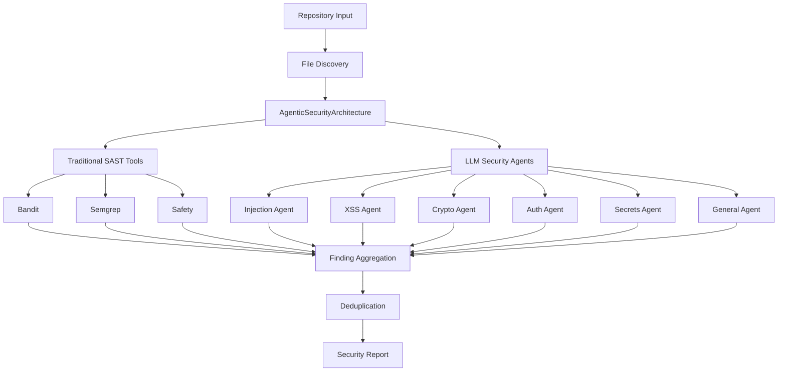

# 🛡️ AI-Powered Code Security Analyzer

[](https://www.python.org/downloads/)
[](https://github.com/blackbox-ai/ai-security-analyzer)

> **Advanced Multi-Agent Security Analysis with LLM Integration**

A cutting-edge security analysis tool that combines the power of **AI-driven agents** with **traditional SAST tools** to provide comprehensive vulnerability detection across your entire codebase.

## 🚀 Key Features

### 🤖 **Multi-LLM Agent Architecture**
- **6 Specialized Security Agents**: Injection, XSS, Crypto, Auth, Secrets, General
- **5+ LLM Models Supported**: GPT-4, Claude 3.5, Gemini, LLaMA 3.3, DeepSeek, Mistral
- **Parallel Processing**: Async/await optimizations for 3-5x faster analysis

### 🔍 **Traditional SAST Integration**
- **Bandit**: Python security linter
- **Semgrep**: Multi-language static analysis
- **Safety**: Python dependency vulnerability scanner
- **pip-audit**: Python package security auditing

### ⚡ **Performance & Scalability**
- **Async Architecture**: Non-blocking I/O for maximum throughput
- **Intelligent Batching**: Optimized API usage with rate limiting
- **Memory Efficient**: Handles large repositories without memory issues
- **CI/CD Optimized**: Special mode for continuous integration

### 📊 **Advanced Reporting**
- **Rich CLI Interface**: Beautiful terminal output with progress tracking
- **JSON/HTML/PDF Reports**: Multiple export formats
- **SARIF Support**: Industry-standard format for security tools
- **Security Scoring**: AI-calculated security score (0-100)

## 🎯 Quick Start

### Installation

```bash
# Clone the repository
git clone https://github.com/blackbox-ai/ai-security-analyzer.git
cd ai-security-analyzer

# Install dependencies
pip install -r requirements.txt

# Install the package
pip install -e .
```

### Get Your OpenRouter API Key

1. Visit [OpenRouter.ai](https://openrouter.ai)
2. Sign up and get your API key
3. Set it as an environment variable:

```bash
export OPENROUTER_API_KEY="your-api-key-here"
```

### Run Your First Scan

```bash
# Scan current directory
security-analyzer scan .

# Scan a GitHub repository
security-analyzer scan https://github.com/user/repo

# Quick scan mode (faster, basic checks)
security-analyzer scan . --quick

# Comprehensive scan with custom output
security-analyzer scan . --mode comprehensive --output my_security_report.json
```

## 📖 Usage Guide

### Command Line Interface

#### Basic Scanning
```bash
# Analyze current directory
security-analyzer scan .

# Analyze specific path
security-analyzer scan /path/to/your/code

# Analyze GitHub repository (auto-clone)
security-analyzer scan https://github.com/user/repository
```

#### Advanced Options
```bash
# Custom configuration
security-analyzer scan . --config config.yaml

# Only traditional SAST tools (no LLM)
security-analyzer scan . --no-llm

# Verbose output for debugging
security-analyzer scan . --verbose

# Quick mode for CI/CD
security-analyzer scan . --quick --mode ci_cd
```

#### Scan Modes
- **`quick`**: Fast scan with basic checks (~2-5 minutes)
- **`comprehensive`**: Full analysis with all agents (~10-30 minutes)
- **`targeted`**: Focus on specific vulnerability types
- **`ci_cd`**: Optimized for continuous integration

### Configuration File

Generate a configuration template:
```bash
security-analyzer config --output analyzer_config.yaml
```

Example configuration:
```yaml
llm:
  api_key: "your-openrouter-key"
  default_model: "openai/gpt-4o-mini"
  temperature: 0.1
  max_tokens: 2000

scan:
  scan_mode: "comprehensive"
  max_concurrent_files: 5
  enable_traditional_sast: true
  enable_bandit: true
  enable_semgrep: true
  enable_safety: true
  
  supported_extensions:
    - ".py"
    - ".js"
    - ".ts"
    - ".java"
    - ".go"
    - ".rs"
    - ".php"
    - ".rb"
    - ".c"
    - ".cpp"

report:
  output_format: "json"
  include_code_snippets: true
  group_by_severity: true
```

## 🏗️ Architecture

### Multi-Agent System

The analyzer uses a sophisticated multi-agent architecture:



### Security Agent Specializations

| Agent | Focus Areas | Models Used |
|-------|-------------|-------------|
| **Injection Agent** | SQL, Command, Code injection vulnerabilities | GPT-4 Turbo |
| **XSS Agent** | Cross-site scripting, HTML injection | Claude 3.5 Sonnet |
| **Crypto Agent** | Cryptographic weaknesses, key management | LLaMA 3.3 70B |
| **Auth Agent** | Authentication/authorization bypasses | DeepSeek R1 |
| **Secrets Agent** | Hardcoded credentials, API keys | Mistral 7B |
| **General Agent** | Path traversal, SSRF, business logic flaws | GPT-4 Turbo |

## 🧪 Testing the Setup

Verify everything is working correctly:

```bash
# Test API connectivity and setup
security-analyzer test

# Test with your API key
security-analyzer test --api-key "your-key"
```

## 🌟 Real-World Examples

### Example 1: Analyzing a Python Flask Application

```bash
security-analyzer scan https://github.com/example/flask-app --mode comprehensive
```

**Sample Output:**
```
🛡️  AI-Powered Security Analyzer
Advanced multi-agent security analysis with LLM integration

🔧 Scan Configuration
├── Target: flask-app/
├── Scan Mode: comprehensive
├── LLM Agents: 6
├── Traditional SAST: ✅ Enabled
└── Max Concurrent Files: 5

🔍 Analyzing repository...

📊 Security Summary
├── Files Scanned: 45
├── Total Findings: 12
├── 🔴 Critical: 2
├── 🟠 High: 3
├── 🟡 Medium: 5
├── 🟢 Low: 2
└── ℹ️ Info: 0

🚨 Top Critical & High Severity Findings
1. 🔴 CRITICAL | SQL Injection | app.py:127 | Unsanitized user input in SQL query
2. 🔴 CRITICAL | Hardcoded Secret | config.py:15 | Database password in source code
3. 🟠 HIGH | XSS | templates/user.html:23 | Unescaped user input in template

🏁 Final Results
🚨 Security Score: 30/100

💡 Recommendations:
1. 🚨 CRITICAL: 2 critical vulnerabilities - address immediately
2. 🛡️ Implement parameterized queries to prevent SQL injection
3. 🔐 Move secrets to environment variables or secure vault
4. 🔄 Consider implementing automated security testing in CI/CD
```

### Example 2: CI/CD Integration

```yaml
# .github/workflows/security.yml
name: Security Analysis
on: [push, pull_request]

jobs:
  security:
    runs-on: ubuntu-latest
    steps:
      - uses: actions/checkout@v3
      
      - name: Setup Python
        uses: actions/setup-python@v4
        with:
          python-version: '3.11'
      
      - name: Install Security Analyzer
        run: |
          git clone https://github.com/heet2201/ai-security-analyzer.git
          cd ai-security-analyzer
          pip install -r requirements.txt
          pip install -e .
      
      - name: Run Security Analysis
        env:
          OPENROUTER_API_KEY: ${{ secrets.OPENROUTER_API_KEY }}
        run: |
          security-analyzer scan . --mode ci_cd --output security-report.json
      
      - name: Upload Security Report
        uses: actions/upload-artifact@v3
        with:
          name: security-report
          path: security-report.json
```

## 🔧 Development

### Project Structure

```
ai-security-analyzer/
├── security_analyzer/           # Main package
│   ├── core/                   # Core architecture
│   │   └── architecture.py     # Main orchestrator
│   ├── agents/                 # Security agents
│   │   └── security_agent.py   # Agent implementations
│   ├── tools/                  # LLM and SAST tools
│   │   ├── llm_provider.py     # Async LLM provider
│   │   └── traditional_sast.py # SAST tools integration
│   ├── models/                 # Data models
│   │   ├── findings.py         # Security findings
│   │   └── config.py           # Configuration models
│   └── cli/                    # Command-line interface
│       └── main.py             # CLI implementation
├── tests/                      # Test suite
├── examples/                   # Usage examples
├── docs/                       # Documentation
├── requirements.txt            # Dependencies
├── setup.py                   # Package setup
└── README.md                  # This file
```

### Running Tests

```bash
# Install development dependencies
pip install -r requirements.txt

# Run unit tests
python -m pytest tests/unit/

# Run integration tests
python -m pytest tests/integration/

# Run all tests with coverage
python -m pytest --cov=security_analyzer tests/
```

### Contributing

1. Fork the repository
2. Create a feature branch: `git checkout -b feature-name`
3. Make your changes and add tests
4. Run the test suite: `pytest`
5. Submit a pull request

## 📚 Supported Languages & Frameworks

| Language | Extensions | SAST Tools | LLM Analysis |
|----------|------------|------------|--------------|
| **Python** | `.py` | Bandit, Safety | ✅ Full Support |
| **JavaScript/TypeScript** | `.js`, `.ts`, `.jsx`, `.tsx` | Semgrep | ✅ Full Support |
| **Java** | `.java` | Semgrep | ✅ Full Support |
| **Go** | `.go` | Semgrep | ✅ Full Support |
| **Rust** | `.rs` | Semgrep | ✅ Full Support |
| **PHP** | `.php` | Semgrep | ✅ Full Support |
| **Ruby** | `.rb` | Semgrep | ✅ Full Support |
| **C/C++** | `.c`, `.cpp`, `.h` | Semgrep | ✅ Full Support |
| **C#** | `.cs` | Semgrep | ✅ Full Support |
| **Scala** | `.scala` | Semgrep | ✅ Full Support |

*Benchmarks on AWS EC2 t3.large with OpenRouter API*

## 🛡️ Security & Privacy

- **API Key Security**: Keys are never logged or stored
- **Code Privacy**: Your code is sent to LLM providers for analysis
- **Data Retention**: Check individual LLM provider policies
- **Local Processing**: Traditional SAST tools run locally

## 🤝 Contributing

We welcome contributions! Please see [CONTRIBUTING.md](CONTRIBUTING.md) for guidelines.

### Development Setup

```bash
# Clone and setup development environment
git clone https://github.com/blackbox-ai/ai-security-analyzer.git
cd ai-security-analyzer

# Create virtual environment
python -m venv venv
source venv/bin/activate  # On Windows: venv\Scripts\activate

# Install in development mode
pip install -e ".[dev]"

# Install pre-commit hooks
pre-commit install
```

---

⭐ **Star this repository if you find it useful!** ⭐

**Made with ❤️ by the Heet Shah** 